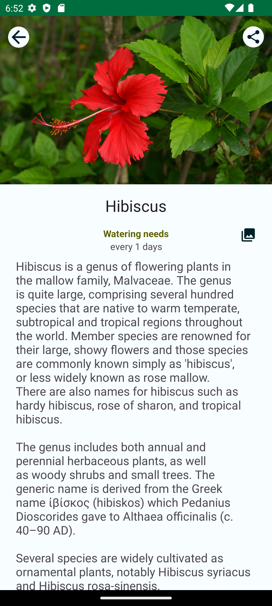

# SunflowerClone

A sample project to demonstrate the practices of the Android app architecture illustrated below. It is a clone of the Android Sunflower app on Github.

**Note**: To see the original Sunflower project, checkout the [`Sunflower`](https://github.com/android/sunflower/tree/views).

## Screenshots

## Features

This example shows how to build an Android project based on the app architecture.
Please see the links below to understand this topic better.

[Guide to app architecture](https://developer.android.com/topic/architecture)

[Guide to Android app modularization](https://developer.android.com/topic/modularization)

## Requirements

### Unsplash API key

Same as the original Sunflower, SunflowerClone uses the [Unsplash API](https://unsplash.com/developers) to load pictures on the gallery
screen. You will need to obtain a free developer API key to make the gallery screen work. Please See the
[Unsplash API Documentation](https://unsplash.com/documentation) for instructions.

Once you have your API key, you can add it by replacing the metadata in the manifest in your application module.

## Third Party Content

Select text used for describing the plants (in `plants_9eabcfec0e4b4af18f213dad403f3e47.json`) are used from Wikipedia via CC BY-SA 3.0 US (license in `ASSETS_LICENSE`).

"[seed](https://thenounproject.com/search/?q=seed&i=1585971)" by [Aisyah](https://thenounproject.com/aisyahalmasyira/) is licensed under [CC BY 3.0](https://creativecommons.org/licenses/by/3.0/us/legalcode)
